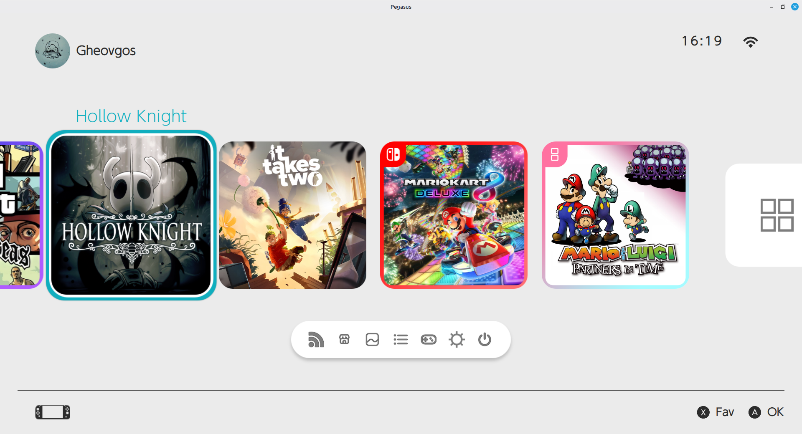
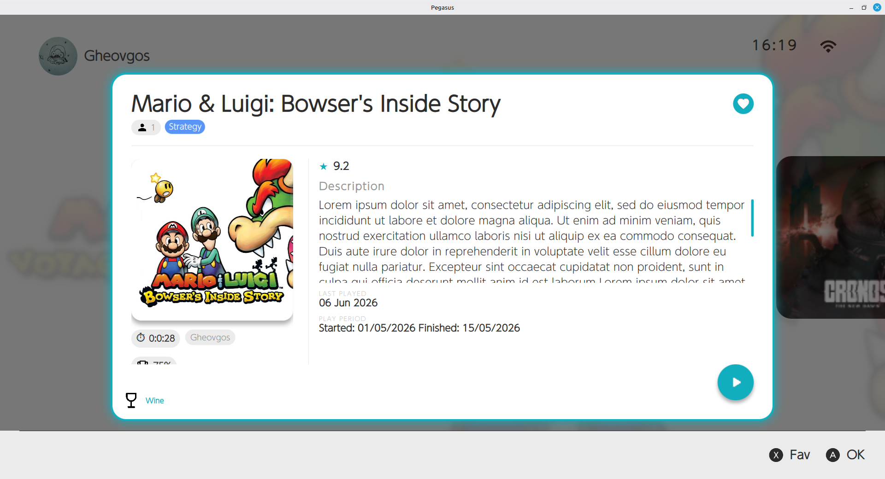
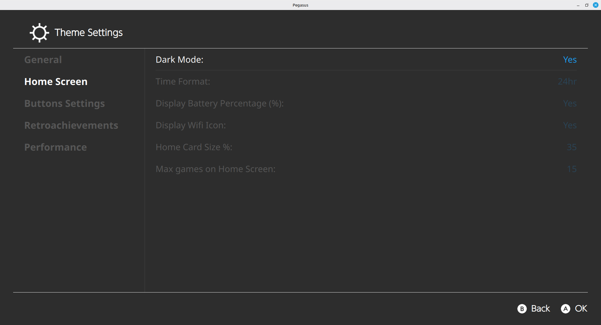

# skylineOS

A clean and simple theme that aims to recreate the experience of Nintendo's Switch 2 console. skylineOS 2 is a theme for [Pegasus Frontend](http://pegasus-frontend.org/) forked from switchOS (fork from RBertoCases/skylineOS).
With this theme, I don’t just want to replicate the Switch’s new style exactly, but I also want to see just how far we can “push” Pegasus, since I think it’s truly underrated. For example, integration with RetroAchievements is in the works (and partially functional, see for example the profile picture), along with much more. Furthermore, as a personal project, I’d like it to be more than just a simple theme, I want it to serve as a personal catalog of titles we’ve played or have on our wishlist.

___

## Disclaimer

I want to make it clear that this started out as a project just to kill time; I didn’t know QML, so in the early stages I relied heavily on AI for help. But as development has progressed, I’ve been having a lot of fun; I’m learning how to master this tool, and my use of generative AI has dropped significantly. I’m against vibe coding; there’s definitely some “messiness” in the code, but I admit it helped me a lot in the beginning (without it, this fork probably would never have been created).

## Installation

Simply download the theme and place it in your [Pegasus theme directory](http://pegasus-frontend.org/docs/user-guide/installing-themes/) under a folder called skylineOS.

You can download the master repository and use it as theme

## Customization

I hate it when things aren't customizable, especially when it costs next to nothing to change them! What you see here is designed to be editable: from the buttons at the bottom to the images, from the descriptions to the settings. For now, there are only a few customizable elements:

- Light/dark theme: imported from the old fork, it does exactly what you'd expect...
- Username: you can set it as you like, or import it from RA
- Retroachievement: for now, it only downloads the image and username (and sets them automatically)
- Wi-Fi/battery icon
- Card size (warning: don’t go over 50, as it breaks for now! A settings reset needs to be implemented)
- Number of cards displayed on screen (default 12)

## Planned features

In order of priority

- Better bottom buttons
- Better RA integration
- More customization! And use all data from metadata
- Exophase support
- More and better visual effects
- Redesign of All games list

No ETA! I work on it on my free time

## Latest Releases

### v0.1

- First public release! We have a lot to do!

See [RELEASES.md](RELEASES.md) for full version history.
___

## Attributions

- SVGs: [SVGrepo](https://www.svgrepo.com/)
- Author: [Zacksly](https://zacksly.itch.io)
- Another author: RBertoCases/skylineOS
- Source: https://zacksly.itch.io/switch-button-icons-and-controls
- License: [CC BY 3.0](https://creativecommons.org/licenses/by/3.0/)
